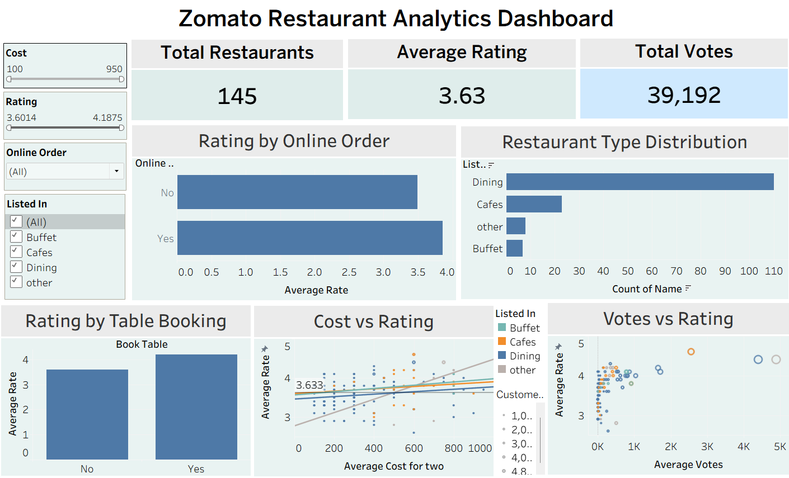

# 📊 Zomato Restaurant Analytics

## 📌 Project Overview

This project performs end-to-end data analysis on Zomato restaurant data to uncover business insights, customer preferences, and performance trends.

## 🛠 Tools & Technologies

* Python (Pandas, NumPy, Matplotlib, Seaborn)
* Power BI
* Excel

## 📊 Key Objectives

* Analyze restaurant ratings and customer engagement
* Study the impact of online ordering and table booking
* Explore cost vs rating relationships
* Identify popular restaurant types

## 🔍 Key Insights

* Restaurants offering table booking tend to have higher ratings
* Online ordering improves customer engagement
* High-cost restaurants do not always guarantee better ratings
* Buffet-type restaurants show higher average ratings

## 📁 Project Structure

* Data Cleaning using Python
* Exploratory Data Analysis (EDA)
* Dashboard development using Power BI

## 📷 Dashboard Preview

## 🚀 Conclusion

This project demonstrates how data-driven insights can help businesses improve decision-making and customer experience.
